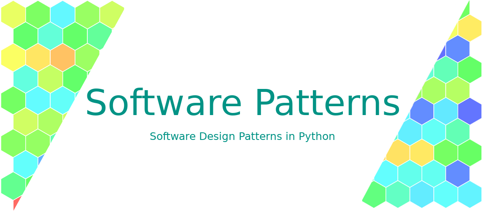

.. Welcome to Software Patterns documentation!
.. ===========================================

|
| These are the documentation pages of the Software Patterns libre software.
| Software Patterns' open source code is hosted on the `boromir674/software-patterns`_ repository on Github and
 its respective `software-patterns`_  Python package (both source and wheel distributions) on Pypi.
| It also features a public `CI workflow`_ hosted on CircleCI.

What are Software Design Patterns?

Software Engineers are employing various designs and solutions to solve their problems.
The emerging (software) patterns, among the code solutions, targeting reoccuring problems have been studied and
formalized in terms of how they are used, what problem they solve and why they are a fit candidate to solve it.
These code designs, which are frequently found in various code bases, are known as Software Design Patterns.

.. toctree::
   :maxdepth: 1
   :caption: Contents:

   introduction
   software-design-patterns
   finalle
   modules

Indices and tables
==================

* :ref:`genindex`
* :ref:`modindex`
* :ref:`search`

.. _boromir674/software-patterns: https://github.com/boromir674/software-patterns

.. _software-patterns: https://pypi.org/project/software-patterns/

.. _CI workflow: https://app.circleci.com/pipelines/github/boromir674/software-patterns?branch=master
