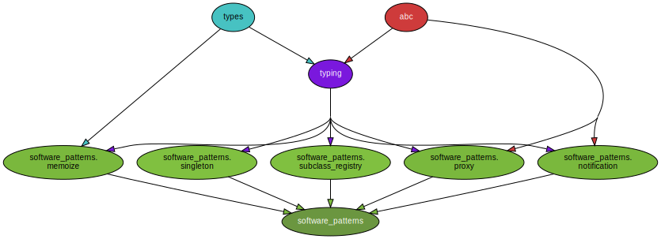
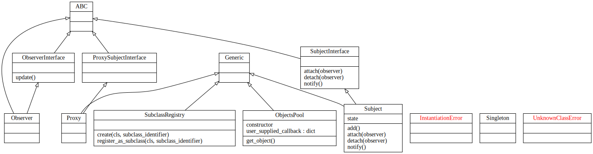

Software Patterns
#################

In this section we dive into the package architecture and the various implementations of Software Design Patterns.

Architecture Overview
=====================

Each implemented pattern corresponds to a python module residing in the `software_patterns` package.

In this section you can see visualizations of the code base capturing the architecture
in the form of `dependency graphs` and class `uml diagrams`.

Dependency Graphs
-----------------

The Dependency Graphs are built by analysing the code and tracking `import` statements.

Inspecting the graph, (corresponding to the code), one can see that `software_patterns` is a "pure" python package.
In other words, the code solely depends on modules belonging to the standard python distribution, namely `abc`, `types` and `typing`
and thus does not require the installation of any external package.

Note: The .svg file showing the dependency graphs has been generated with the `pydeps` tool.
Note: We have a dedicated tox environment (see tox.ini) for generating svg (or png) files depicting the dependency graphs.

Uml Diagrams
------------

The Unified Modeling Language is used to depict the important interfaces
of the `software_patterns` package's classes.

Note: The .svg file showing the uml class diagrams has been generated with the legacy `pyreverse` tool which is comes bundled in the `pylint`.
Note: We have a dedicated tox environment (see tox.ini) for generating svg (or png) files depicting the uml class diagrams.

|

Patterns Implementations
========================

We provide Python implementations of various Software Design Patterns.

.. toctree::
   :maxdepth: 4
   :glob:

   patterns-implementations/*
